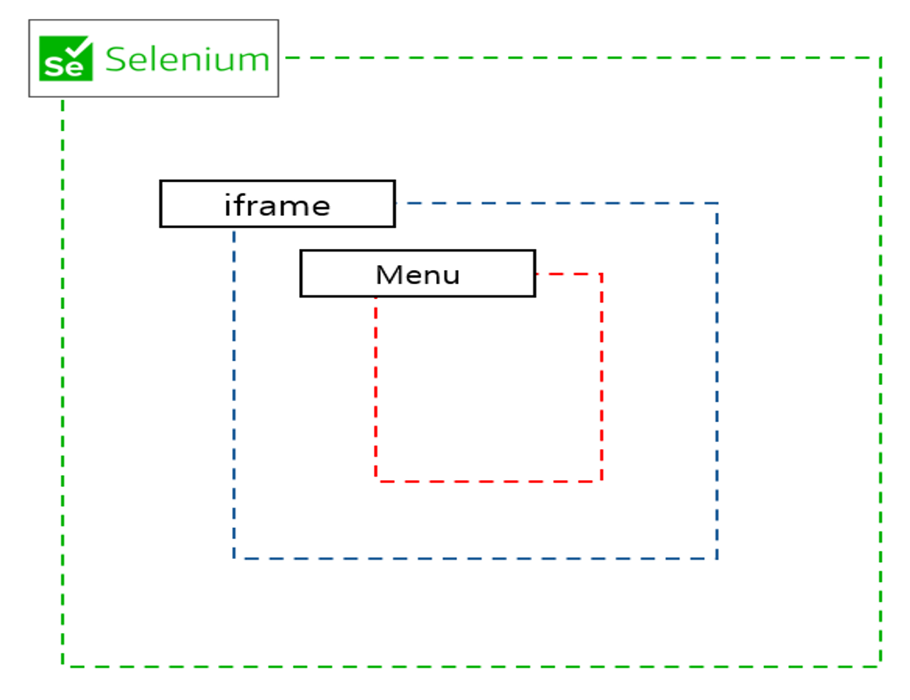
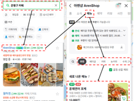
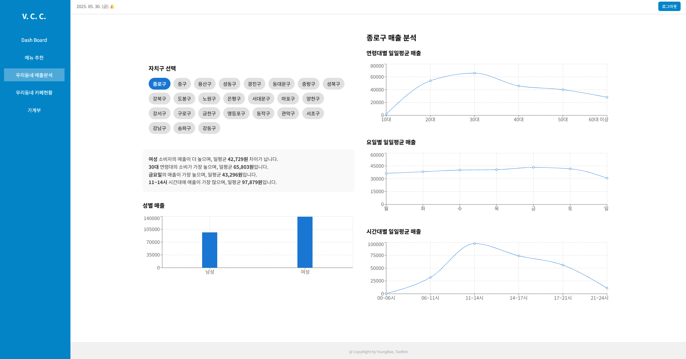
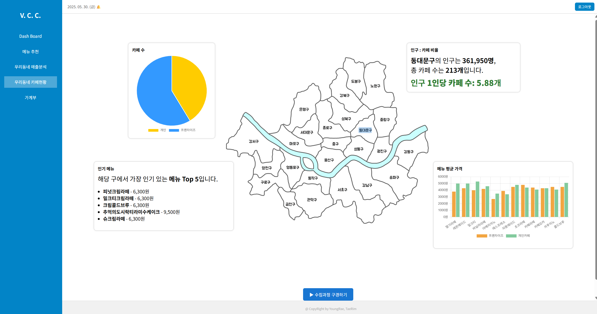

서울시 자치구의 카페 메뉴 정보를 네이버 지도 기반으로 크롤링하고, 이를 전처리하여 분석 가능한 형태로 구조화한 프로젝트입니다.  
iframe, 무한스크롤, 그룹형/이미지 메뉴 등 복잡한 DOM 구조를 자동으로 대응하도록 구성되어 있습니다.

## 🛰️ 크롤링 과정 개요

검색 결과와 상세 페이지는 각각 `searchIframe`과 `entryIframe` 내에 위치하며,  
정확한 컨텍스트 전환을 통해 두 프레임을 오가며 정보를 수집하도록 설계하였다.

---

크롤링은 네이버 지도 내 무한 스크롤 영역에서 진행되며,  
scrollBy 및 scrollHeight 감지를 통해 모든 카페 항목을 탐색한 후,  
각 카페의 메뉴 탭 클릭 → 메뉴 항목/가격 수집 → 이미지 메뉴 수집까지 일련의 과정을 자동화하였다.

---

## 📊 수집 결과 예시

## 🙋 담당 역할

본인은 크롤링 및 데이터 전처리 파트를 담당하였습니다.
